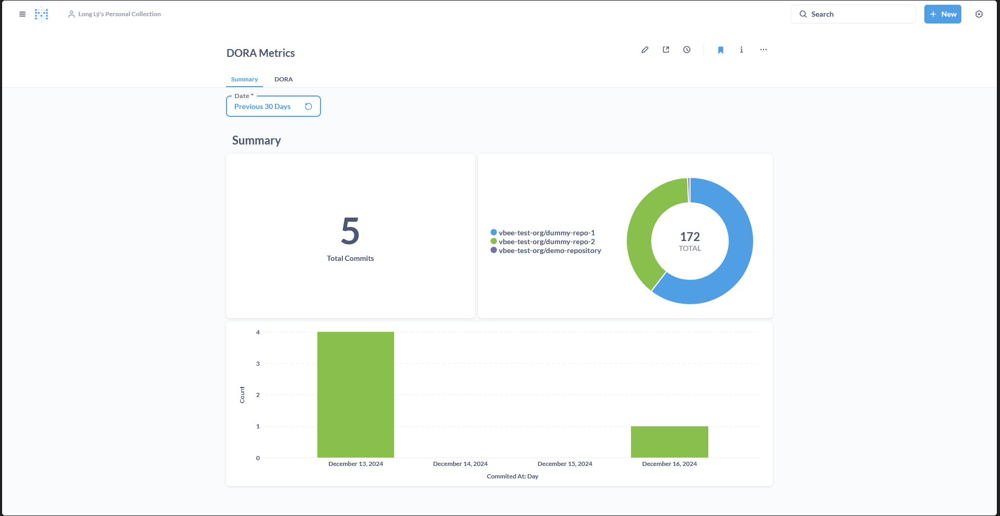
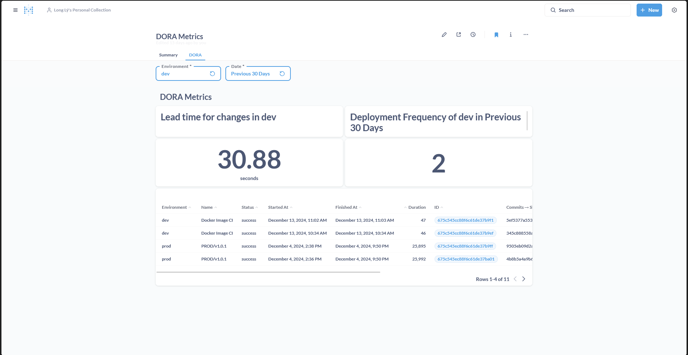

# DORA Tracker
A simple tool to track a repository DORA metrics, currently we only implement 2 out of 4 metrics: Lead time for changes and Deployment frequency

For more information about DORA metrics and how to calculate them, please visit [DevOps Research and Assessment (DORA) metrics](https://docs.gitlab.com/ee/user/analytics/dora_metrics.html)

## Installation ⚙️

### 0. Pre-installation 🛠️  

#### The `.env` file
Before you install, make sure you have this in your `.env` file (or just prepare it if you use Docker):

```
PORT=5000
MONGO_URI="<YOUR_CONNECTION_STRING_HERE>"
MONGO_DB_NAME="<YOUR_DB_NAME_HERE>"

REDIS_URL="<YOUR_REDIS_URL_HERE>"

# You will be rate limited if this is not specified
# TO create your Personal Access Token (PAT) on Github, do the following:
# 1. Click on your profile icon > Settings
# 2. Scroll down and you will see `Developer Settings` on the left panel > Personal access token > Tokens (classic)
# 3. Create a new token, set the name, duration and with full control of private repositories > Generate token > Copy the token and paste it here (and save it somewhere safe for future use)

GH_PAT="<YOUR_GITHUB_PERSONAL_ACCESS_TOKEN_HERE>"

GH_WEBHOOK_SECRET="<YOUR_WEBHOOK_SECRET>" # Can be anything you like, but must be secure

GH_ORG_NAME="<YOUR_ORG_NAME>"

UAT_DOC_ID="<YOUR_GOOGLE_DOCS_UAT_CHANGELOG_ID_HERE>"
PROD_DOC_ID="<YOUR_GOOGLE_DOCS_PROD_CHANGELOG_ID_HERE>"
```

#### Google Cloud Console setup
After setting this up:
1. Go to [Google Cloud Console](https://console.cloud.google.com).
2. Create a new organization and project.
3. Enable appropriate APIs and create a new service account credential.
4. Download the key file, rename it to google.json, and place it in the project root.
5. Give service account permissions to read the changelog Google Docs file (Share > enter the service account email).

For more info, please watch this [video](https://www.youtube.com/watch?v=AxsuxUjzKdY&ab_channel=CodingwithAdo).

#### Google Docs setup
For each of your Google Docs file, go to Extensions > App Scripts and copy the example code written [here](./docs/example/). After that, you will deploy the script, go to `Triggers` tab and add a trigger (currently, we only trigger the script hourly which is not effective!).

The script will read the latest version and if curr ver > saved ver, it will send a message to the server (Just like a webhook!!!, the server will process and update the database).

### 1. Using Node.js 📦

```
# Install all dependencies
npm install # or npm ci

# build
npm run build

# Start server
npm run start
```

### 2. Using Docker 🐳

```
docker build -t <your-prefered-app-name> .

docker run -e PORT=5000 \
-e MONGO_URI='<smt>' \
-e MONGO_DB_NAME='<smt>' \
-e GH_PAT='<smt>' \
-e REDIS_URL='<smt>' \
-e GH_WEBHOOK_SECRET='<smt>' \
-e GH_ORG_NAME='<smt>' \
-e UAT_DOC_ID='<smt>' \
-e PROD_DOC_ID='<smt>' \
-p 5000:5000 \
--name <container-name> <image-name>
```

Once the container is running, the app will be available at `http://localhost:5000`.

## Data visualization

We use [Metabase](https://www.metabase.com/) to visualize data. 

Metabase does provide cloud service but with some $$$, so we will be using local deployment. There are 2 methods to achieve this:
- Pull their official Docker image and run them in a container with environment variables.
- Download official `.jar` file from them and run with environment variables.

More info [here](https://www.metabase.com/docs/latest/installation-and-operation/installing-metabase)

Metabase uses H2 as their default database which is not production-ready, we are advised to use PostgreSQL or MySQL. Below are the options for deployment:

### 1. Local deployment via Docker 🐳

```
docker run -d -p 3000:3000 \
  -e "MB_DB_TYPE=postgres" \
  -e "MB_DB_DBNAME=metabaseappdb" \
  -e "MB_DB_PORT=5432" \
  -e "MB_DB_USER=name" \
  -e "MB_DB_PASS=password" \
  -e "MB_DB_HOST=my-database-host" \
   --name metabase metabase/metabase
```

### 2. Local deployment via `.jar` file ☕

```
export MB_DB_TYPE=postgres
export MB_DB_DBNAME=metabase
export MB_DB_PORT=5432
export MB_DB_USER=<username>
export MB_DB_PASS=<password>
export MB_DB_HOST=localhost
java --add-opens java.base/java.nio=ALL-UNNAMED -jar metabase.jar
```

After setup, access Metabase at http://localhost:3000. Load your data and customize dashboards. Example dashboards:





## Related Documentations 📚
- [Expressjs](https://expressjs.com/en/4x/api.html)
- [Github API Documentation](https://docs.github.com/en/rest?apiVersion=2022-11-28)
- [Mongoose](https://mongoosejs.com/docs/typescript.html)
- [googleapis Documentation](https://www.npmjs.com/package/googleapis): This is the documentation of Google's SDK to authenticate and read Google Docs. For more information, watch this [video](https://www.youtube.com/watch?v=AxsuxUjzKdY&ab_channel=CodingwithAdo). Btw, Google documentation sucks.
- [Quick Bullmq Documentation](https://betterstack.com/community/guides/scaling-nodejs/bullmq-scheduled-tasks/): The server is packed with a background worker, whose job is to queue incoming jobs and process it. 
- [Quick Typescript Documentation](https://www.typescriptlang.org/docs/handbook/typescript-in-5-minutes.html)
- [Metabase](https://www.metabase.com/docs/latest/)

## Contribution 🤝

### Instructions ✍️
If you have read to this point, we think you know the drill! Fork the repository, commit and push...

### TODO 📝
- Add security features to stop unauthorized access to the server
- Research ways to get Google Docs update time to scan UAT change log

## License 📜
[MIT](./LICENSE)
